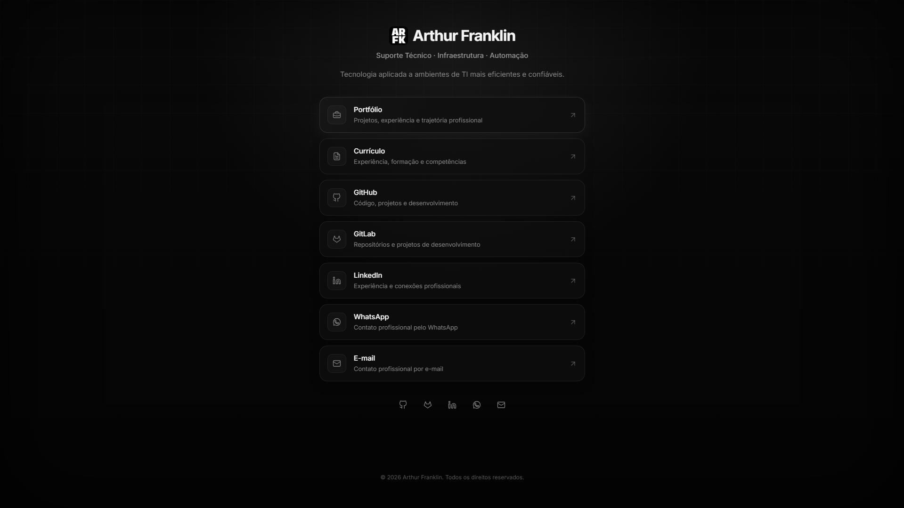

# Link Hub

Um hub pessoal de links leve, desenvolvido com HTML semântico e CSS moderno, com foco em desempenho, acessibilidade, privacidade e segurança.

Sem frameworks. Sem JavaScript. Sem rastreamento.



**Demo Online:** [arthurfranklin.com.br/links](https://arthurfranklin.com.br/links)

## Visão Geral

O Link Hub é uma página estática que centraliza meu portfólio, projetos, perfis profissionais e canais de contato em uma única interface responsiva.

O projeto utiliza intencionalmente uma arquitetura minimalista baseada apenas em HTML e CSS. Ele prioriza carregamento rápido, manutenção simples, acessibilidade e uma superfície de ataque reduzida no lado do cliente, sem depender de frameworks JavaScript, scripts de terceiros ou dependências em tempo de execução.

A instância em produção faz parte do ecossistema do meu portfólio pessoal e é disponibilizada no caminho `/links`.

## Funcionalidades

- Interface responsiva para dispositivos desktop e móveis
- Estrutura HTML semântica
- Zero JavaScript
- Zero dependências em tempo de execução
- Fonte Inter hospedada localmente
- Arquivos de favicon locais
- Estados de foco visíveis para navegação por teclado
- Suporte à redução de movimento com `prefers-reduced-motion`
- Página 404 personalizada
- Metadados Open Graph
- URL canônica
- `robots.txt` e sitemap XML
- Content Security Policy restritiva
- Cabeçalhos HTTP adicionais de segurança

## Tecnologias

| Tecnologia | Finalidade |
| --- | --- |
| HTML5 | Estrutura semântica e conteúdo |
| CSS3 | Layout, design responsivo, animações e estilização visual |
| Inter | Tipografia da interface hospedada localmente |
| Hospedagem estática | Implantação sem runtime de aplicação |

O projeto não possui gerenciador de pacotes, processo de build, bundle JavaScript ou framework no lado do cliente.

## Estrutura do Projeto

```text
link-hub/
├── docs/
│   └── link-hub-preview.png
├── public/
│   ├── css/
│   │   └── style.css
│   ├── favicon/
│   └── fonts/
├── .gitignore
├── 404.html
├── _headers
├── index.html
├── LICENSE
├── README.md
├── README.pt-BR.md
├── robots.txt
└── sitemap.xml
```

## Segurança e Privacidade

O Link Hub segue um modelo de segurança deliberadamente restritivo, adequado à sua arquitetura estática.

A aplicação não requer execução de JavaScript, conexões com APIs externas, frames incorporados, fontes de terceiros, ferramentas de analytics, publicidade ou scripts de rastreamento.

A implantação define uma Content Security Policy restritiva e cabeçalhos HTTP adicionais de segurança, incluindo:

- `Content-Security-Policy`
- `X-Content-Type-Options`
- `X-Frame-Options`
- `Referrer-Policy`
- `Permissions-Policy`
- `X-XSS-Protection`

A Content Security Policy restringe explicitamente recursos desnecessários para a aplicação, incluindo scripts, conexões externas, objetos, frames, formulários, mídia, workers e manifests.

Imagens, fontes e estilos são limitados a recursos da mesma origem de acordo com os requisitos da interface.

Serviços externos são acessados somente quando um visitante segue explicitamente um dos links disponíveis na página.

## Acessibilidade

A interface inclui considerações de acessibilidade em toda a sua estrutura e estilização:

- Elementos HTML semânticos
- Rótulos acessíveis e descritivos
- Elementos gráficos decorativos excluídos da árvore de acessibilidade quando apropriado
- Estados de foco visíveis para navegação por teclado com `:focus-visible`
- Estrutura lógica de títulos e conteúdo
- Layouts responsivos
- Suporte à redução de movimento por meio de `prefers-reduced-motion`

O conteúdo principal e a navegação permanecem disponíveis sem scripts no lado do cliente.

## SEO

O projeto inclui metadados e recursos para mecanismos de busca referentes à sua página em produção:

- Título da página e meta description
- URL canônica
- Metadados Open Graph
- Metadados Twitter Card
- `robots.txt`
- Sitemap XML

A URL canônica de produção é:

```text
https://arthurfranklin.com.br/links
```

## Implantação

A implementação em produção foi projetada para ser disponibilizada em:

```text
/links
```

Os arquivos estáticos são, portanto, referenciados sob:

```text
/links/public/
```

Por exemplo:

```text
/links/public/css/style.css
/links/public/fonts/Inter-Regular.woff2
/links/public/favicon/favicon-192x192.png
```

Esse caminho base é intencional e reflete a arquitetura de implantação em produção.

Como o Link Hub não possui etapa de build nem dependências em tempo de execução, ele pode ser implantado como conteúdo estático. Ao implantar o projeto em um caminho base diferente, as referências correspondentes aos arquivos e os metadados de produção devem ser ajustados.

## Personalização

Este repositório contém minha implementação pessoal do Link Hub, mas sua estrutura pode ser adaptada para outros perfis.

Os principais pontos de personalização incluem:

- Nome e descrição profissional
- Links para portfólio e projetos
- Perfis em redes profissionais
- Canais de contato
- Metadados e URL canônica
- Favicons e identidade visual
- Tipografia e estilização
- Caminho base de implantação
- `robots.txt`
- `sitemap.xml`

Como o projeto não utiliza framework ou sistema de build, essas alterações podem ser realizadas diretamente nos arquivos-fonte HTML e CSS.

## Licença

Este projeto está licenciado sob a Licença MIT. Consulte [`LICENSE`](LICENSE) para mais detalhes.

---

Desenvolvido por **Arthur Franklin** · [Read in English](README.md) · [Licença MIT](LICENSE)
